Gradient decent
===============

Srilakshmi Alla

Contents
--------

-   [Yule Walker equations](#2)
-   [Gradient Descent solution to 2\*2 matrix equation](#3)
-   [Notes](#6)

Consider a second order filter u(n)=v(n)-a1\*u(n-1)-a2\*u(n-2)

where filter coefficients are

``` {.codeinput}
a1=[-0.1950 -0.9750 -1.5955 -1.9114];
a2=[0.9500 0.9500 0.9500 0.9500];
```

Yule Walker equations {#2}
---------------------


``` {.codeinput}
%figure('Name','Four sets of eigen values','NumberTitle','off');


for k=1:4

ruu0(k)=((1+a2(k))./(1-a2(k))).*(1/(((1+a2(k)).^2)-(a1(k).^2)));
ruu1(k)=((-a1(k))./(1+a2(k))).*ruu0(k);
ruu2(k)=(-a2(k)+((a1(k)).^2)/(1+a2(k))).*ruu0(k);


% Correlation matrix

Ruu{1,k}=[ruu0(k) ruu1(k);ruu1(k) ruu0(k)];
ruu{1,k}=[ruu1(k);ruu2(k)];

% Eigen values and eigen vectors of correlation matrix

[V{1,k},D{1,k}]=eig(Ruu{1,k});

lamda1(1,k)=D{1,k}(1,1);
lamda2(1,k)=D{1,k}(2,2);

% Maximum size of convergence factor mu is largest eigenvalue of the
% correlation matrix for a gradient descent
mu_max=2./max(lamda1,lamda2) ;

% Plot of four sets of eigen vectors
subplot(2,2,k);
plot(V{1,k});
str = sprintf('Eigen vector coressponding to %0.3f and %0.3f',lamda1(1,k),lamda2(1,k));
title(str,'FontSize',8);

end
```

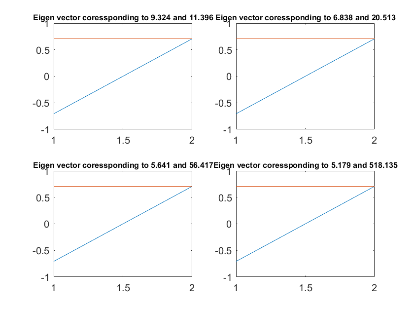

Gradient Descent solution to 2\*2 matrix equation {#3}
-------------------------------------------------

mu values

``` {.codeinput}
mu_value=[0.1 0.5 0.99 1 1.01];
mu=mu_value'*mu_max
```

``` {.codeoutput}
mu =

    0.0176    0.0098    0.0035    0.0004
    0.0878    0.0488    0.0177    0.0019
    0.1737    0.0965    0.0351    0.0038
    0.1755    0.0975    0.0355    0.0039
    0.1773    0.0985    0.0358    0.0039
```

This part of program helps us in understanding the role of convergence
factor and weights

Algorithm for all 4 sets of filter weights and mu values

``` {.codeinput}
for k=1:4 % loop for weights
   for p=1:5 % loop for mu values

        ww{p,k}(1:2,:)=[0;0];

   for nn=1:100 % loop for iterations

        ww_sv{p,k}(:,nn)=ww{p,k};
        ww{p,k}=ww{p,k}+mu(p,k).*(ruu{1,k}-Ruu{1,k}*ww{p,k});
    end
   end

end
```

Plot of Time responses of sucessive values of the two component of the
weight vector as well as the parametric plot(w1 vs w2)

``` {.codeinput}
for k=1:4
    for p=1:5

figure(p+(k-1).*5);

subplot(1,2,1);
plot(ww_sv{p,k}(1,:),ww_sv{p,k}(2,:),'-x','linewidth',2);
grid on;

subplot(1,2,2);
plot(ww_sv{p,k}(1,:),'k');
hold on;
plot(ww_sv{p,k}(2,:),'r--');
hold off;

str2=sprintf('Parametric and Time response plot a1=%0.4f a2=%0.4f mu=%0.2f*mumax',a1(k),a2(k),mu_value(p));
figtitle(str2,'FontSize',8);
grid on;

    end

end
```

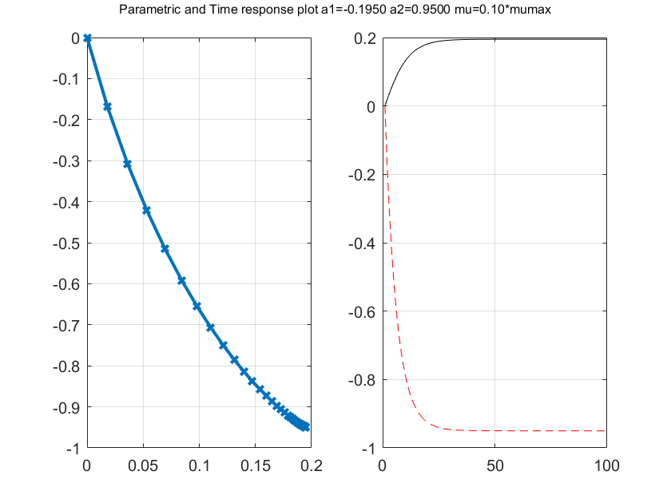 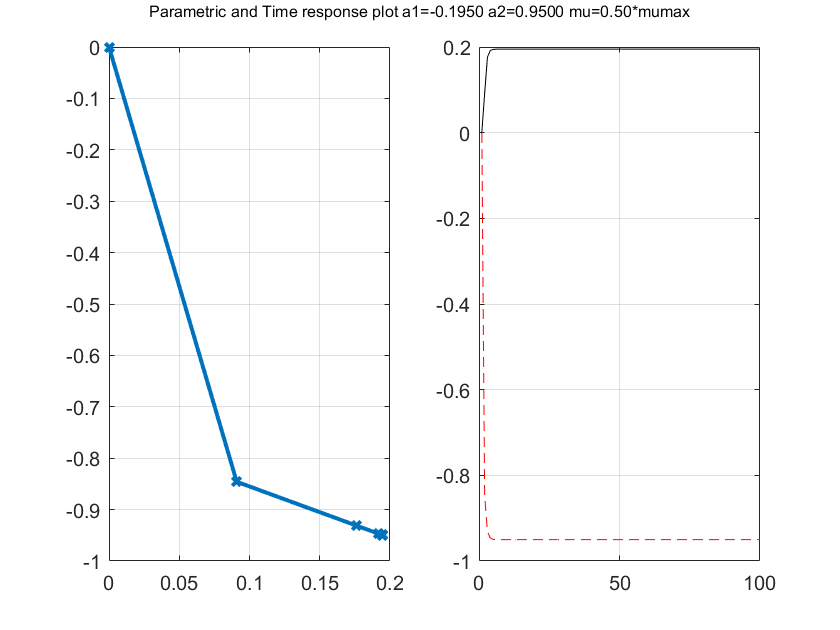
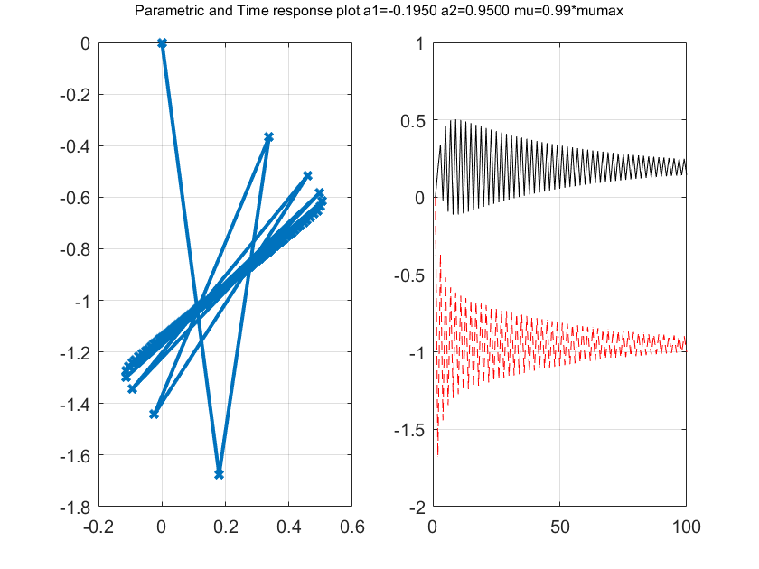 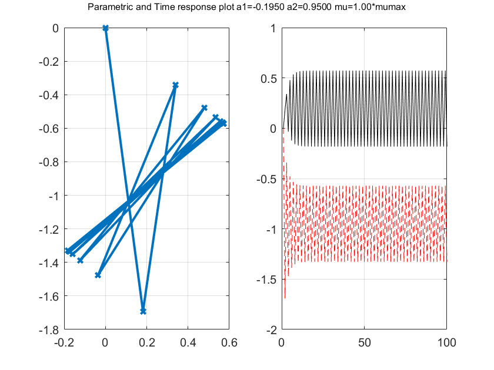
 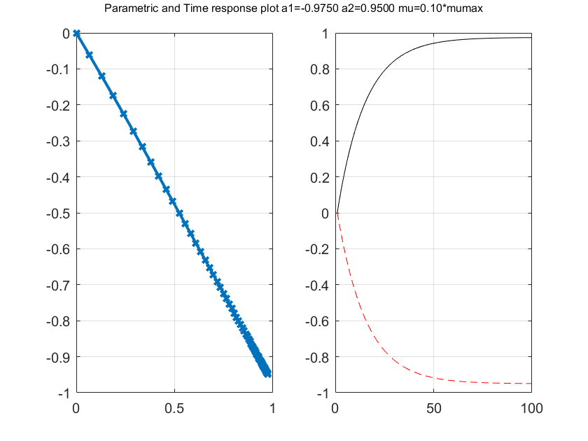
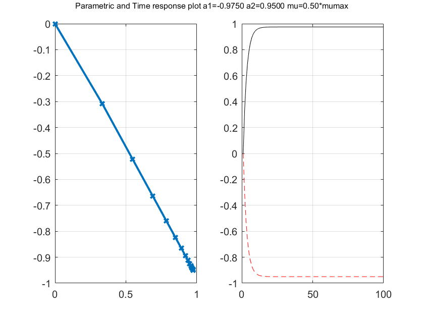 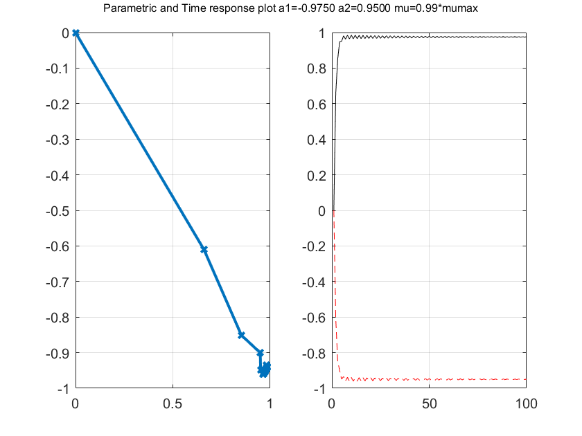
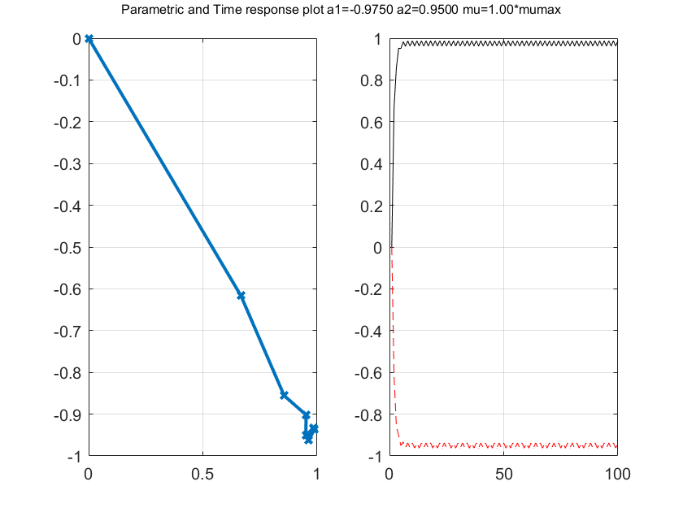 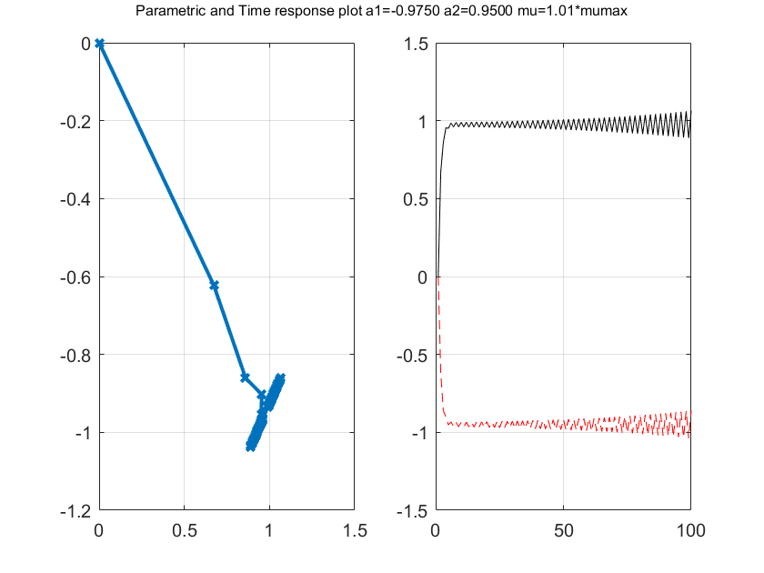
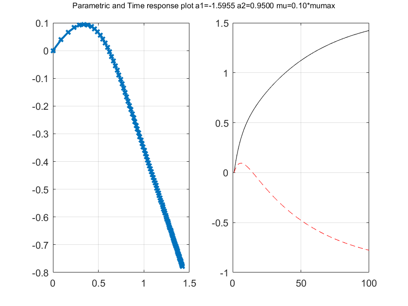 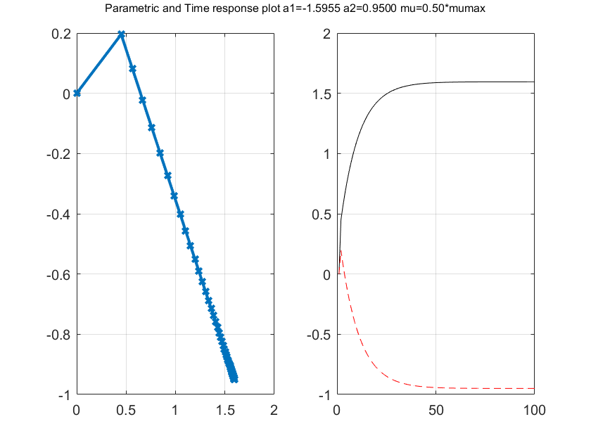
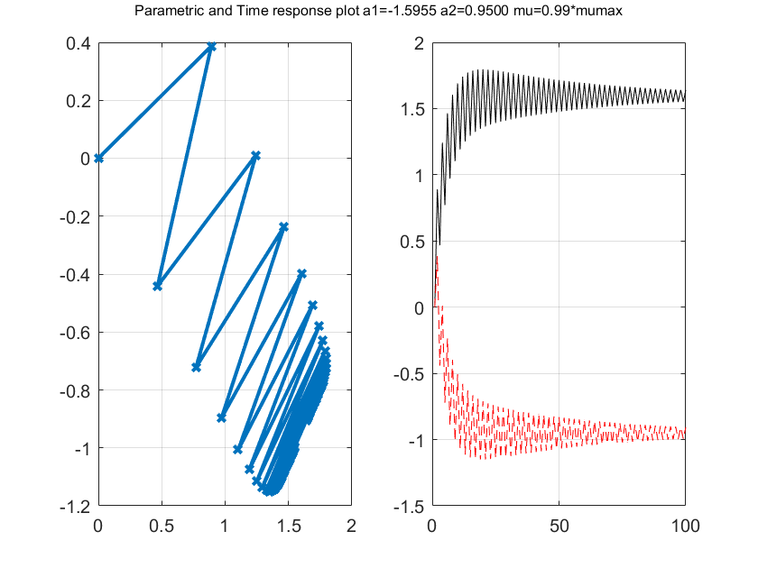 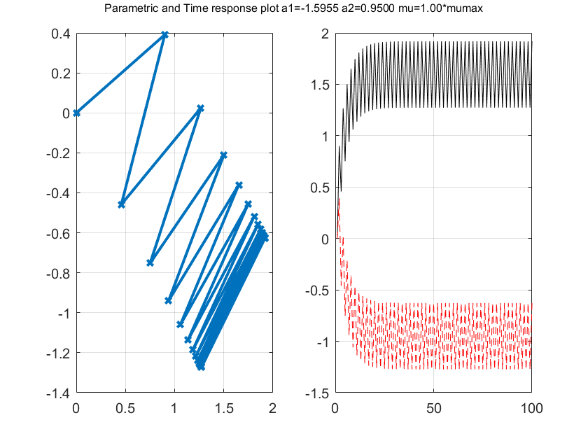
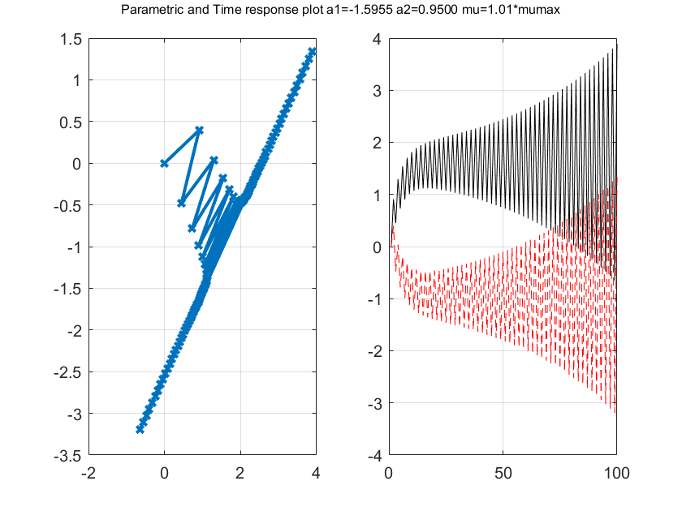 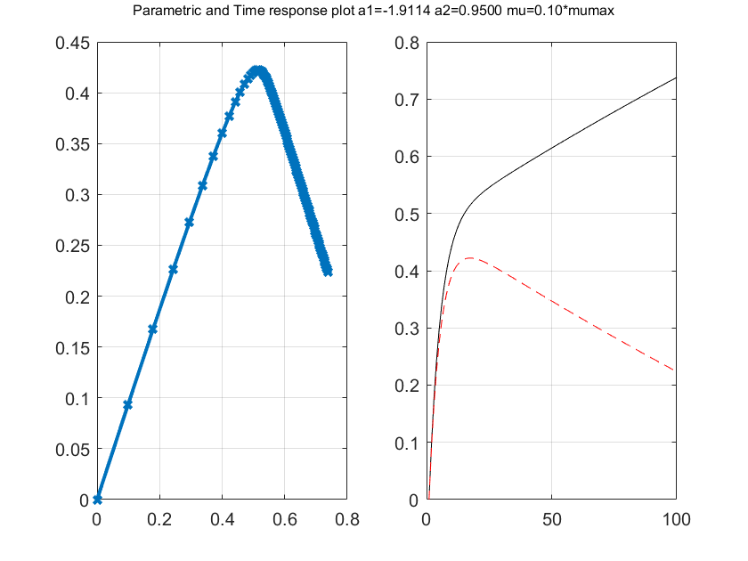
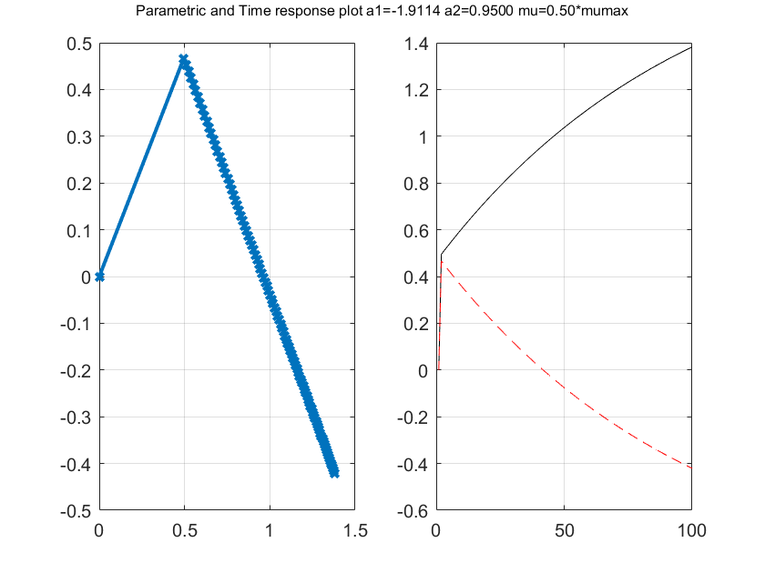 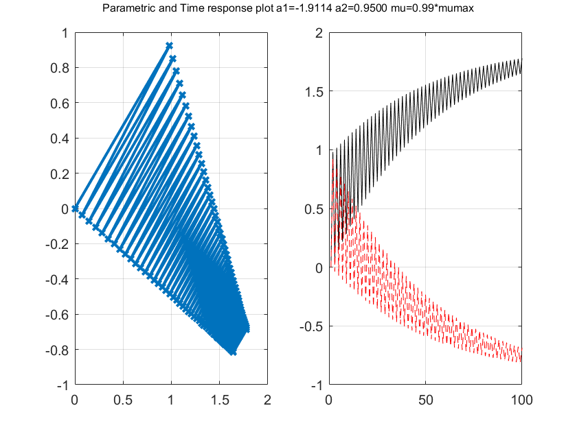
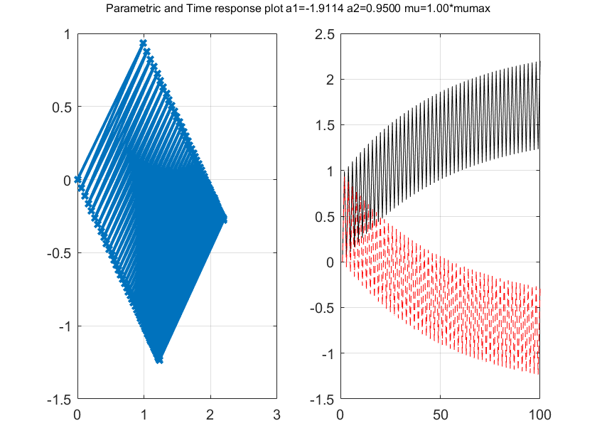 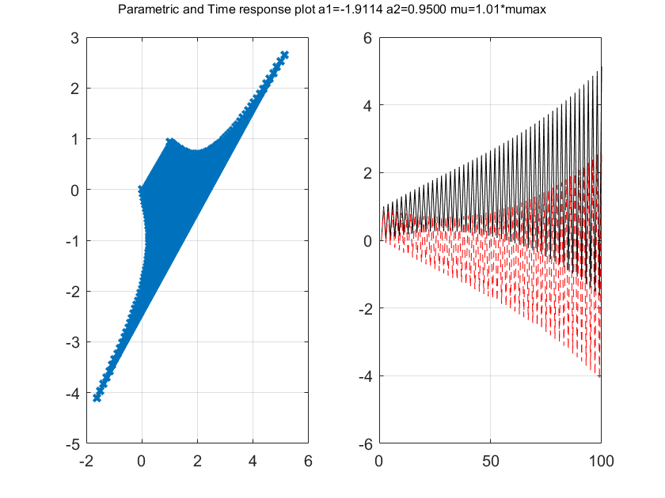

Notes {#6}
-----

Too small values of mu will cause our algorithm to converge very
slowly.On the other hand,two large mu value could cause our algorithm to
overshoot the minima and diverge.This is evident when the plots are
observed.

\
[Published with MATLAB®
R2017a](http://www.mathworks.com/products/matlab/)\

